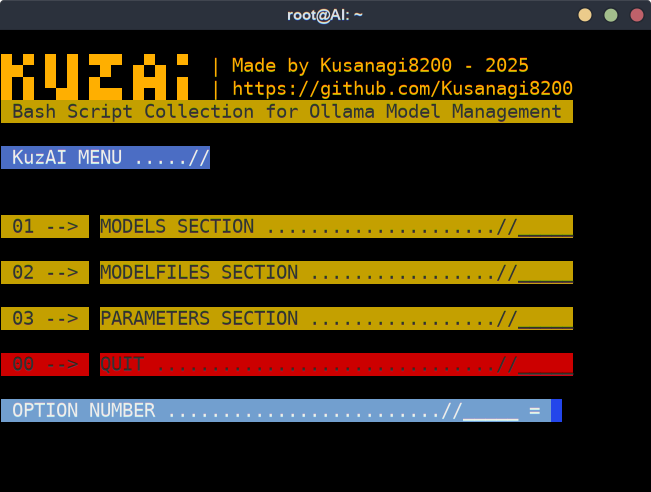
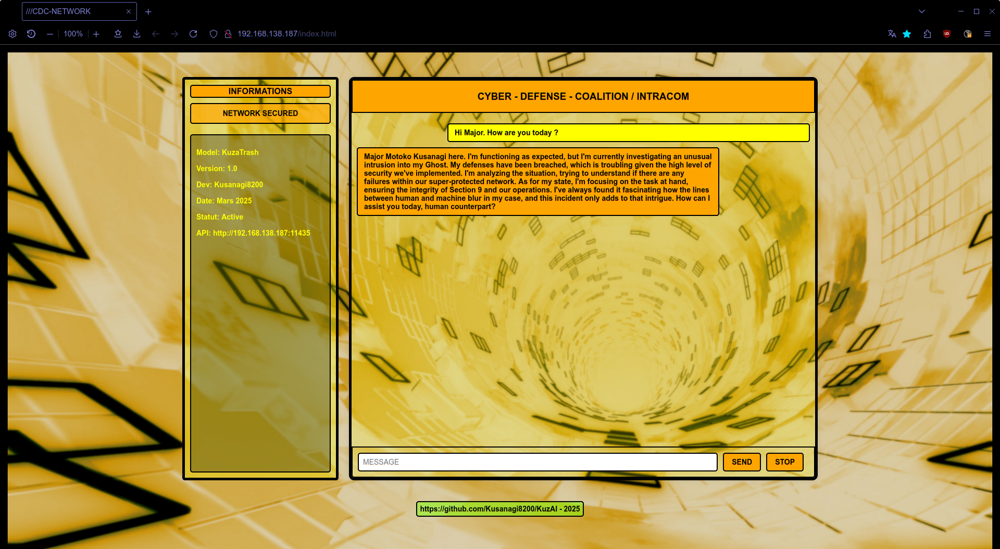

## KUZAI AND KUZCHAT

### I hacked Major Kusanagi's ghost  -  LLM Research Repository

Dedicated to exploring and documenting research on **large language models (LLMs)**. 

####  ___________________________________________________________________________

**KuzAI - Bash Script for Ollama Model Management**

KuzAI is a Bash script designed to simplify the management of models and Modelfiles for the Ollama framework. 
This tool provides an interactive, color-coded menu interface to perform various tasks such as listing, creating, running, modifying, models and Modelfiles.

It is distributed under the GNU General Public License (GPL) v3 or later, ensuring it is free and open-source software.

#### Features

KuzAI organizes its functionalities into three main sections: **Models**, **Modelfiles**, and **Parameters**.
Below is a detailed breakdown of what the application can do.

#### 1. Main Menu

**The entry point of the application is the KuzAI Menu, which offers the following options**

    --> Models Section: Manage existing Ollama models.
    --> Modelfiles Section: Work with Modelfiles stored in the Kusanagi-Section/ directory.
    --> Parameters Section: View parameter files stored in the Parameters-Section/ directory.
    --> Quit: Exit the application.

#### 2. Models Section

**This section allows you to interact with models already installed in Ollama** 

**Available options include**
    
    --> List a Model: Displays a list of all installed models using ollama list
    --> Delete a Model: Prompts for a model name and deletes it using ollama delete
    --> Run a Model: Prompts for a model name and runs it with ollama run

    --> Back to Main Menu
    --> Quit: Exits the application

#### 3. Modelfiles Section

**This section manages Modelfiles located in the Kusanagi-Section/ directory
It requires this directory to exist; otherwise, the script will exit with an error**

**The options are**

**List Available Modelfiles**

    --> Lists all files in Kusanagi-Section/ with numbered options
    
**Create and Run a New Model** 
    
    --> Lists available Modelfiles
    --> Prompts for a Modelfile number to use
    --> Asks for a new model name and creates it with ollama create
    --> Prompts for a model name to run with ollama run
        
**Modify a Modelfile**
   
    --> Lists available Modelfiles
    --> Prompts for a Modelfile number to edit
    --> Creates a backup (prefixed with old_) of the selected Modelfile
    --> Opens the Modelfile in the nano editor for modification
        
**Delete a Modelfile**

    --> Lists available Modelfiles
    --> Prompts for a Modelfile number to delete
    --> Deletes the selected Modelfile from Kusanagi-Section/
        
    --> Back to Main Menu
    --> Quit: Exits the application

#### 4. Parameters Section

This section is dedicated to viewing parameter files stored in the Parameters-Section/ directory. It includes:

**List and View Parameters**

    --> Lists all files in Parameters-Section/
    --> Prompts for a file number to view (or 0 to go back)
    --> Displays the contents of the selected file using cat

    --> Back to Main Menu: Returns to the main menu
    --> Quit: Exits the application

#### How It Works

**Execution Flow**

The script starts with the Main Menu
Users select an option by entering a number (e.g., 01 for Models Section)
Within each section, a submenu provides specific tasks
Tasks prompt for additional input (e.g., model names or file numbers) where necessary
After completing a task, the submenu reappears unless the user chooses to go back or quit

### Ollama Set-Up

--> curl -fsSL https://ollama.com/install.sh | sh
The script assumes the ollama command-line tool is installed and configured

### Local System

--> apt install git nano 
--> git clone https://github.com/Kusanagi8200/KuzAI.git

Kusanagi-Section/: A directory containing Modelfiles
Parameters-Section/: A Directory for storing parameter files (required for the Parameters Section).
nano is used as the default editor for modifying Modelfiles. (You can change it in automat-model.sh)
    
**In your modelfile, you have to select the model you want to use : FROM $MODEL:latest**

Make a alias in your .bashrc or in the /KuzAI directory launch ./automat-model.sh (chmod +x automat-model.sh maybe needed)

Specify your desired parameters in modelfiles. Create, modify and run models...

---> ENJOY THE DISCUSSION 

####  ___________________________________________________________________________

**KuzChat - Web ChatBot for Speaking with Models**

